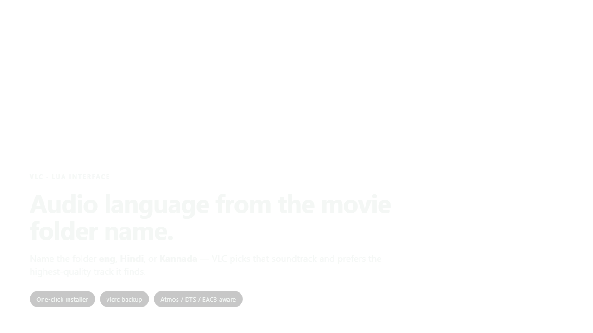
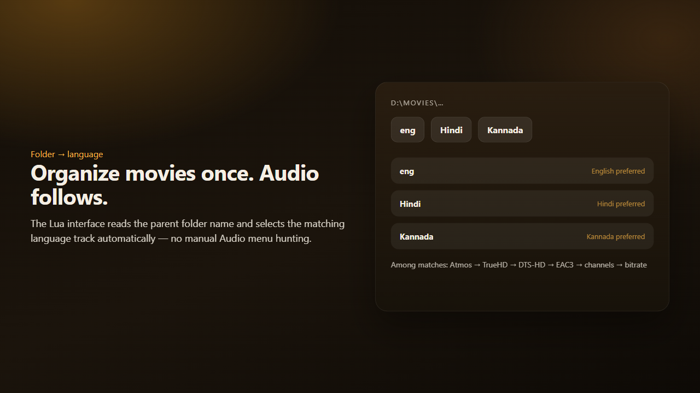
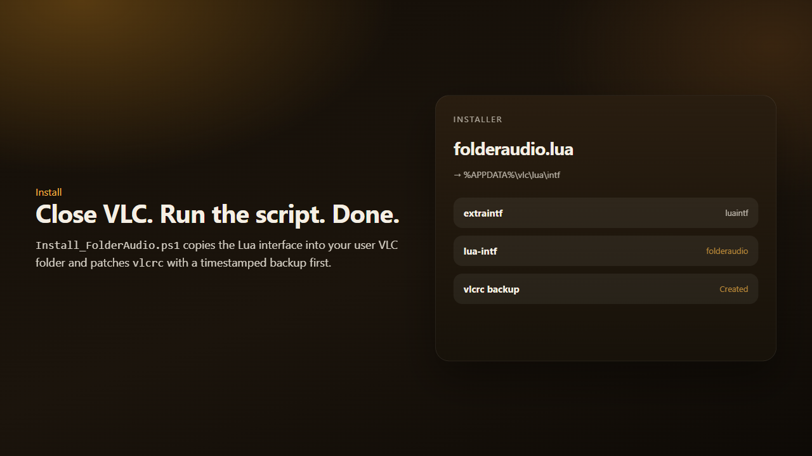

<div align="center">

# VLC Folder Audio

**Pick the soundtrack from the movie folder name** — and prefer the highest-quality track VLC finds.

| Folder name contains | Prefers |
| :---: | :---: |
| `eng` | English |
| `Hindi` | Hindi |
| `Kannada` | Kannada |

[](https://www.videolan.org/)
[](#-getting-started)
[](#-getting-started)

</div>

<div align="center">
  
</div>

---

## Why this exists

Movie libraries often keep language in the **folder name**, while the file itself has many audio tracks. Manually opening Audio → Track every time is slow. **VLC Folder Audio** installs a small Lua interface that reads the parent folder and selects the matching language — preferring Atmos / TrueHD / DTS-HD / EAC3 when several matches exist.

> Built by **Nishanth K R** — *son of a farmer, always a farmer.*

---

## What you can do

- **Folder → language** — `eng` / `Hindi` / `Kannada` keywords drive the preferred soundtrack.
- **Quality-aware** — among language matches, prefer higher-quality codecs and channel layouts.
- **One-click install** — PowerShell copies the Lua interface and patches `vlcrc` (with backup).
- **No manual track pick** — loads as a VLC Lua interface automatically.
- **Easy to extend** — add more language keywords in the Lua script.

---

## Preview

<div align="center">
  
  <p><em>Name the folder once — audio follows.</em></p>
</div>

<div align="center">
  
  <p><em>Close VLC → run Install_FolderAudio.ps1 → done.</em></p>
</div>

---

## Tech stack

| Layer | Technology |
| --- | --- |
| Player | VLC for Windows |
| Logic | Lua interface (`folderaudio.lua`) |
| Installer | PowerShell (`Install_FolderAudio.ps1`) — copies to `%APPDATA%\vlc\lua\intf`, patches `vlcrc` |

---

## Getting started

### Requirements

- [VLC](https://www.videolan.org/) for Windows  
- PowerShell (built-in)

### Install

1. **Close VLC** completely (tray icon too).  
2. Clone and run the installer from this folder:

```bash
git clone https://github.com/Nishanth1409/vlc-folder-audio.git
cd vlc-folder-audio
```

```powershell
powershell -ExecutionPolicy Bypass -File .\Install_FolderAudio.ps1
```

The script copies `folderaudio.lua` into your VLC user `lua\intf` folder and updates `vlcrc` (a timestamped backup is created first).

### Verify

1. Put a movie inside a folder named e.g. `eng`, `Hindi`, or `Kannada`.  
2. Open that file with VLC.  
3. Audio should follow the folder language when matching tracks exist.

### How it works

| File | Role |
| :--- | :--- |
| `folderaudio.lua` | VLC Lua interface logic |
| `Install_FolderAudio.ps1` | Install / patch VLC user config |

### Tips

- Re-run `Install_FolderAudio.ps1` after you update `folderaudio.lua`.  
- If something breaks, restore the `vlcrc.bak-folderaudio-*` backup from `%APPDATA%\vlc`.  
- Adjust the Lua script if you need more language keywords.  

## License

Personal / portfolio use. Review before redistributing.

---

<div align="center">

Made with care by **Nishanth K R** — *son of a farmer, always a farmer.*

[Portfolio](https://nkrportfolio.vercel.app) · [GitHub](https://github.com/Nishanth1409)

</div>
